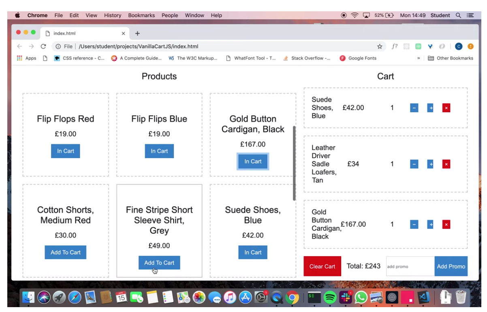

# Cart
A basic web app that allows the user to add items to their cart 

# User Stories 
```
As a User I can view the products and their category, price and availability information.
 
As a User I can add a product to my shopping cart.

As a User I can remove a product from my shopping cart.

As a User I can view the total price for the products in my shopping
cart.

As a User I can apply a voucher to my shopping cart.

As a User I can view the total price for the products in my shopping cart
with discounts applied.

As a User I am alerted when I apply an invalid voucher to my shopping
cart.

As a User I am unable to Out of Stock products to the shopping cart.
```

# Tech Used 
* VanillaJs
* Html 
* CSS

# QuickStart
```
$ git clone https://github.com/CazaBelle/cart-vanilla-js.git

$ cd cart-vanilla-js 

$ open index.html
```

# How to use 
* open index.html
* add items you want into your cart 
* add numerical discounts - offer codes not yet implemented

# Demo 
[](https://youtu.be/pFW-GAft_zI)

# Approach 
* As this was intended as an experimental attempt at the test there was no testing. I wanted to use this opportunity to explore javascript instead of using a Ruby which would have been more comfortable. 
* I assumed once I had felt more comfortable with language I would have time to redo the project with a testing framework. This is a quick solution that meets most of the requirements and is fully responsive. 
* Hard coding the values into the html made getting to the logic quicker but is restrictive in terms of expansion. 
* The user can add/remove items from their basket and add discounts 
* The lack of a testing framework made refractoring the code quite tricky hence why I have repeated the assignment using TDD with Jasmine. 
* An incomplete version using TDD can be seen here [Retail Therapy JS]!(https://github.com/CazaBelle/retail-therapy-js) 


